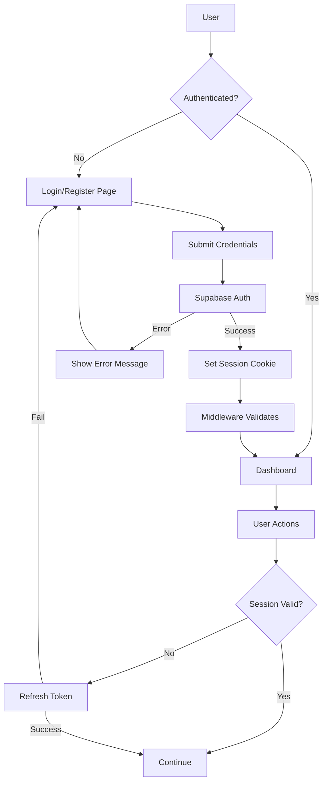

# Design Document - Supabase Auth UI

## Overview

This design document outlines the implementation of a modern, secure authentication system using Supabase Auth with shadcn UI components. The system will enhance the existing auth pages with improved UX, better error handling, password reset functionality, and proper integration with Next.js 14 App Router using the latest `@supabase/ssr` package.

The design focuses on:
- Modern, neutral-colored UI using shadcn components
- Server-side authentication with proper session management
- Secure password reset flow
- Smooth loading states and transitions
- Mobile-responsive design
- Integration with existing middleware and routing

## Architecture

### Authentication Flow



### Component Architecture

```
src/
├── app/
│   ├── auth/
│   │   ├── login/
│   │   │   ├── page.tsx (Enhanced login UI)
│   │   │   └── actions.ts (Server actions)
│   │   ├── register/
│   │   │   ├── page.tsx (Enhanced register UI)
│   │   │   └── actions.ts (Server actions)
│   │   ├── reset-password/
│   │   │   ├── page.tsx (Password reset request)
│   │   │   └── actions.ts (Server actions)
│   │   ├── update-password/
│   │   │   ├── page.tsx (New password form)
│   │   │   └── actions.ts (Server actions)
│   │   ├── confirm/
│   │   │   └── route.ts (Email confirmation handler)
│   │   └── signout/
│   │       └── route.ts (Logout handler)
├── utils/
│   └── supabase/
│       ├── client.ts (Browser client)
│       ├── server.ts (Server client)
│       └── middleware.ts (Session refresh)
└── middleware.ts (Route protection)
```

## Components and Interfaces

### 1. Supabase Client Utilities

#### Browser Client (`utils/supabase/client.ts`)
```typescript
import { createBrowserClient } from '@supabase/ssr'

export function createClient() {
  return createBrowserClient(
    process.env.NEXT_PUBLIC_SUPABASE_URL!,
    process.env.NEXT_PUBLIC_SUPABASE_ANON_KEY!
  )
}
```

#### Server Client (`utils/supabase/server.ts`)
```typescript
import { createServerClient } from '@supabase/ssr'
import { cookies } from 'next/headers'

export async function createClient() {
  const cookieStore = await cookies()
  
  return createServerClient(
    process.env.NEXT_PUBLIC_SUPABASE_URL!,
    process.env.NEXT_PUBLIC_SUPABASE_ANON_KEY!,
    {
      cookies: {
        getAll() {
          return cookieStore.getAll()
        },
        setAll(cookiesToSet) {
          try {
            cookiesToSet.forEach(({ name, value, options }) =>
              cookieStore.set(name, value, options)
            )
          } catch {
            // Server Component - ignore
          }
        },
      },
    }
  )
}
```

#### Middleware Helper (`utils/supabase/middleware.ts`)
```typescript
import { createServerClient } from '@supabase/ssr'
import { NextResponse, type NextRequest } from 'next/server'

export async function updateSession(request: NextRequest) {
  let supabaseResponse = NextResponse.next({ request })
  
  const supabase = createServerClient(
    process.env.NEXT_PUBLIC_SUPABASE_URL!,
    process.env.NEXT_PUBLIC_SUPABASE_ANON_KEY!,
    {
      cookies: {
        getAll() {
          return request.cookies.getAll()
        },
        setAll(cookiesToSet) {
          cookiesToSet.forEach(({ name, value }) => 
            request.cookies.set(name, value)
          )
          supabaseResponse = NextResponse.next({ request })
          cookiesToSet.forEach(({ name, value, options }) =>
            supabaseResponse.cookies.set(name, value, options)
          )
        },
      },
    }
  )
  
  // Refresh session
  await supabase.auth.getUser()
  
  return supabaseResponse
}
```

### 2. Authentication Pages

#### Login Page Design
- **Layout**: Centered card with neutral background gradient
- **Components**:
  - Email input with icon
  - Password input with show/hide toggle
  - Submit button with loading state
  - "Forgot password?" link
  - "Sign up" link
  - Optional: Google OAuth button
- **Color Scheme**: 
  - Background: Neutral gray gradient (slate-50 to slate-100)
  - Card: White with subtle shadow
  - Primary actions: Neutral slate-900
  - Text: Gray scale (700-900)
  - Accents: Subtle blue for links

#### Register Page Design
- Similar layout to login
- Additional fields:
  - Confirm password with validation
  - Password strength indicator
- Success state showing email confirmation message

#### Password Reset Flow
1. **Request Reset Page**:
   - Email input
   - Submit button
   - Success message with instructions
   
2. **Update Password Page**:
   - New password input
   - Confirm password input
   - Password requirements display
   - Submit button

### 3. Server Actions

#### Login Action (`auth/login/actions.ts`)
```typescript
'use server'

import { revalidatePath } from 'next/cache'
import { redirect } from 'next/navigation'
import { createClient } from '@/utils/supabase/server'

export async function login(formData: FormData) {
  const supabase = await createClient()
  
  const data = {
    email: formData.get('email') as string,
    password: formData.get('password') as string,
  }
  
  const { error } = await supabase.auth.signInWithPassword(data)
  
  if (error) {
    return { error: error.message }
  }
  
  revalidatePath('/', 'layout')
  redirect('/dashboard')
}
```

#### Register Action (`auth/register/actions.ts`)
```typescript
'use server'

import { revalidatePath } from 'next/cache'
import { createClient } from '@/utils/supabase/server'

export async function signup(formData: FormData) {
  const supabase = await createClient()
  
  const data = {
    email: formData.get('email') as string,
    password: formData.get('password') as string,
  }
  
  const { error } = await supabase.auth.signUp(data)
  
  if (error) {
    return { error: error.message }
  }
  
  revalidatePath('/', 'layout')
  return { success: true }
}
```

#### Password Reset Actions
```typescript
'use server'

import { createClient } from '@/utils/supabase/server'

export async function resetPassword(formData: FormData) {
  const supabase = await createClient()
  const email = formData.get('email') as string
  
  const { error } = await supabase.auth.resetPasswordForEmail(email, {
    redirectTo: `${process.env.NEXT_PUBLIC_SITE_URL}/auth/update-password`,
  })
  
  if (error) {
    return { error: error.message }
  }
  
  return { success: true }
}

export async function updatePassword(formData: FormData) {
  const supabase = await createClient()
  const password = formData.get('password') as string
  
  const { error } = await supabase.auth.updateUser({
    password: password
  })
  
  if (error) {
    return { error: error.message }
  }
  
  return { success: true }
}
```

## Data Models

### User Session
```typescript
interface Session {
  access_token: string
  refresh_token: string
  expires_in: number
  expires_at?: number
  token_type: string
  user: User
}

interface User {
  id: string
  email: string
  email_confirmed_at?: string
  created_at: string
  updated_at: string
  user_metadata: Record<string, any>
}
```

### Form State
```typescript
interface AuthFormState {
  email: string
  password: string
  confirmPassword?: string
  loading: boolean
  error: string | null
  success: boolean
}
```

## Error Handling

### Error Types and Messages
```typescript
const AUTH_ERRORS = {
  'Invalid login credentials': 'Email atau password salah',
  'Email not confirmed': 'Silakan konfirmasi email Anda terlebih dahulu',
  'User already registered': 'Email sudah terdaftar',
  'Password should be at least 6 characters': 'Password minimal 6 karakter',
  'Unable to validate email address': 'Format email tidak valid',
}
```

### Error Display Strategy
1. **Inline Errors**: Show validation errors below input fields
2. **Alert Banners**: Show authentication errors at top of form
3. **Toast Notifications**: Show success messages
4. **Loading States**: Disable form during submission

### Error Recovery
- Clear errors on input change
- Provide actionable error messages
- Link to password reset from login errors
- Link to login from registration errors

## Testing Strategy

### Unit Tests
1. **Form Validation**:
   - Email format validation
   - Password length validation
   - Password match validation
   - Required field validation

2. **Server Actions**:
   - Login with valid credentials
   - Login with invalid credentials
   - Registration with valid data
   - Registration with existing email
   - Password reset request
   - Password update

### Integration Tests
1. **Authentication Flow**:
   - Complete registration flow
   - Email confirmation flow
   - Login and redirect flow
   - Logout flow
   - Password reset flow

2. **Session Management**:
   - Session persistence across refreshes
   - Session expiration handling
   - Token refresh mechanism
   - Protected route access

### E2E Tests
1. **User Journeys**:
   - New user registration → email confirmation → login
   - Existing user login → access dashboard
   - Forgot password → reset → login with new password
   - Logout → attempt to access protected route → redirect to login

## Security Considerations

### Password Requirements
- Minimum 8 characters
- At least one uppercase letter (optional but recommended)
- At least one number (optional but recommended)
- No common passwords

### Session Security
- HTTP-only cookies for session storage
- Secure flag in production
- SameSite=Lax for CSRF protection
- Short-lived access tokens (1 hour)
- Refresh token rotation

### Rate Limiting
- Implement rate limiting on auth endpoints
- Use Supabase's built-in rate limiting
- Add client-side debouncing

### Input Sanitization
- Validate email format
- Sanitize user inputs
- Prevent SQL injection (handled by Supabase)
- XSS protection (handled by React)

## UI/UX Design Specifications

### Color Palette (Neutral Theme)
```css
/* Light Mode */
--background: 0 0% 100%           /* White */
--foreground: 222.2 84% 4.9%      /* Near Black */
--card: 0 0% 100%                 /* White */
--card-foreground: 222.2 84% 4.9% /* Near Black */
--primary: 222.2 47.4% 11.2%      /* Dark Slate */
--primary-foreground: 210 40% 98% /* Light Gray */
--muted: 210 40% 96.1%            /* Light Gray */
--muted-foreground: 215.4 16.3% 46.9% /* Medium Gray */
--border: 214.3 31.8% 91.4%       /* Light Border */

/* Dark Mode */
--background: 222.2 84% 4.9%      /* Dark */
--foreground: 210 40% 98%         /* Light */
--card: 222.2 84% 4.9%            /* Dark */
--card-foreground: 210 40% 98%    /* Light */
--primary: 210 40% 98%            /* Light */
--primary-foreground: 222.2 47.4% 11.2% /* Dark */
```

### Typography
- **Headings**: Inter font, font-bold
- **Body**: Inter font, font-normal
- **Labels**: font-medium, text-sm
- **Inputs**: font-normal, text-base

### Spacing
- Card padding: p-6 (24px)
- Form spacing: space-y-4 (16px)
- Input height: h-11 (44px)
- Button height: h-11 (44px)

### Animations
- Form transitions: transition-all duration-200
- Loading spinner: animate-spin
- Success checkmark: animate-in fade-in
- Error shake: animate-shake (custom)

### Responsive Design
- Mobile: Full width with p-4 padding
- Tablet: max-w-md centered
- Desktop: max-w-md centered with larger spacing

## Implementation Notes

### Migration from Existing Code
1. Update `@supabase/auth-helpers-nextjs` to `@supabase/ssr`
2. Replace client creation utilities
3. Update middleware to use new session refresh pattern
4. Enhance existing auth pages with new features
5. Add password reset functionality
6. Improve error handling and loading states

### Environment Variables Required
```env
NEXT_PUBLIC_SUPABASE_URL=your_supabase_url
NEXT_PUBLIC_SUPABASE_ANON_KEY=your_anon_key
NEXT_PUBLIC_SITE_URL=http://localhost:3000
```

### Supabase Email Templates
Update email templates in Supabase dashboard:
- **Confirm signup**: `{{ .SiteURL }}/auth/confirm?token_hash={{ .TokenHash }}&type=email`
- **Reset password**: `{{ .SiteURL }}/auth/update-password?token_hash={{ .TokenHash }}&type=recovery`

## Performance Considerations

### Code Splitting
- Lazy load OAuth providers
- Separate auth pages from main bundle
- Use dynamic imports for heavy components

### Caching
- Cache static assets
- Use SWR for client-side data fetching
- Implement proper cache headers

### Bundle Size
- Tree-shake unused Supabase features
- Minimize shadcn UI imports
- Use production builds

## Accessibility

### WCAG 2.1 AA Compliance
- Proper label associations
- Keyboard navigation support
- Focus indicators
- ARIA labels for icons
- Error announcements
- Color contrast ratios > 4.5:1

### Screen Reader Support
- Semantic HTML
- Descriptive button text
- Form field descriptions
- Error message associations
- Loading state announcements
